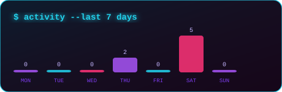
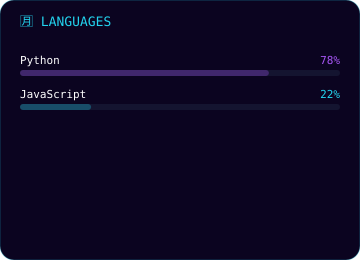
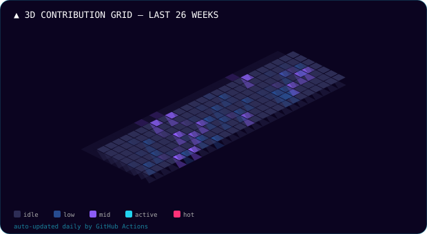
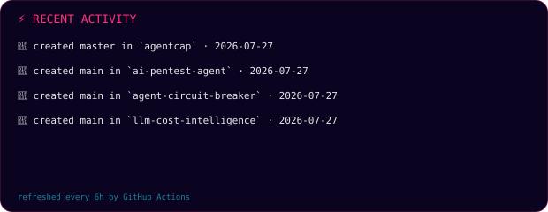

<p align="center">
  
</p>

<p align="center">
  
</p>

<p align="center">
  
</p>

<p align="center">
  
  
  
  
  
</p>

<p align="center">
  
  
  
</p>

## 🧬 About Me

```python
class Erfix404:
    """Neural core of an autonomous agent builder."""

    def __init__(self):
        self.name = "Erfan Ashouri"
        self.location = "Shahroud, Iran 🇮🇷"
        self.focus = ["AI Agents", "Python", "n8n Automation", "Ethical Hacking"]
        self.currently = "Building autonomous agents that ship themselves 🚀"

    def daily_routine(self):
        while True:
            self.build_agent()
            self.break_things_ethically()
            self.ship_to_production()
```

## 🛠️ Tech Stack

<p align="center">
  
</p>

## 🏆 Stats

<table align="center">
  <tr>
    <td></td>
    <td></td>
  </tr>
</table>

## 📊 Contribution Grid

<p align="center">
  
</p>

<p align="center">
  
</p>

<p align="center">
  
</p>

## ⚡ Recent Activity


<!-- LATEST-ACTIVITY:START -->
**`2026-08-31`** · ⭐ starred [`isArman/scientific-fa-translation-skill`](https://github.com/isArman/scientific-fa-translation-skill)

**`2026-08-26`** · ⭐ starred [`itsyebekhe/nahan`](https://github.com/itsyebekhe/nahan)

<!-- LATEST-ACTIVITY:END -->


<p align="center">
  
</p>

## 📦 Projects

| Project | Description | Stack |
|---------|-------------|-------|
| [agentcap](https://github.com/Erfix404/agentcap) | AI agent capabilities framework | Python |
| [hallucination-shield](https://github.com/Erfix404/hallucination-shield) | Guard against LLM hallucinations | Python |
| [ai-pentest-agent](https://github.com/Erfix404/ai-pentest-agent) | Autonomous pentesting agent | Python |
| [tool-call-quality-gate](https://github.com/Erfix404/tool-call-quality-gate) | Quality gates for tool calls | Python |

## 📊 GitHub Stats

<p align="center">
  
  
</p>

## 🎯 Trophies

<p align="center">
  
</p>

## 🤝 Connect

<p align="center">
  <a href="https://github.com/Erfix404"></a>
  <a href="mailto:erfix404@gmail.com"></a>
  <a href="https://t.me/erfix404"></a>
</p>

---

<p align="center">
  <i>⚡ Auto-generated by 4 GitHub Actions — stats refresh daily, activity every 6 hours, snake daily.</i>
</p>
